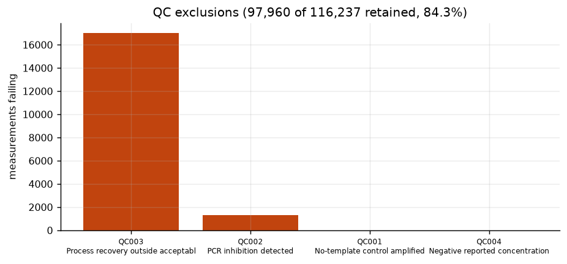
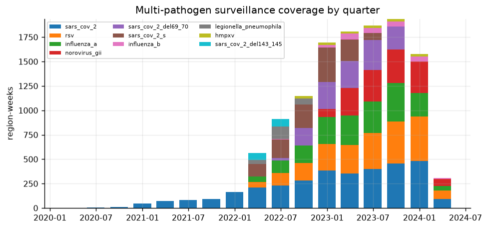
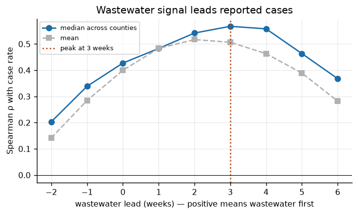
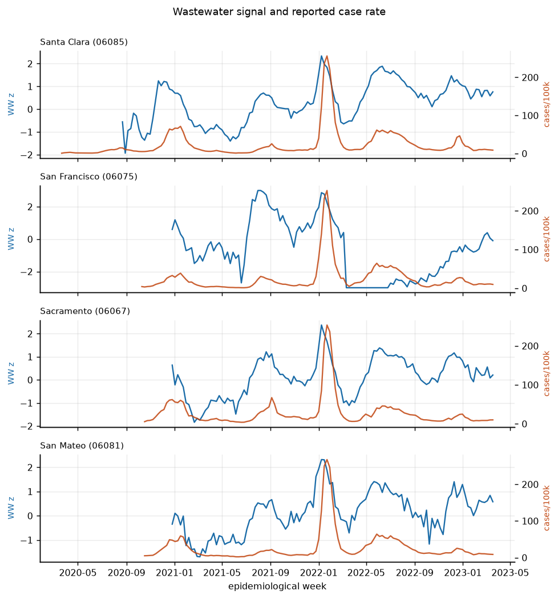
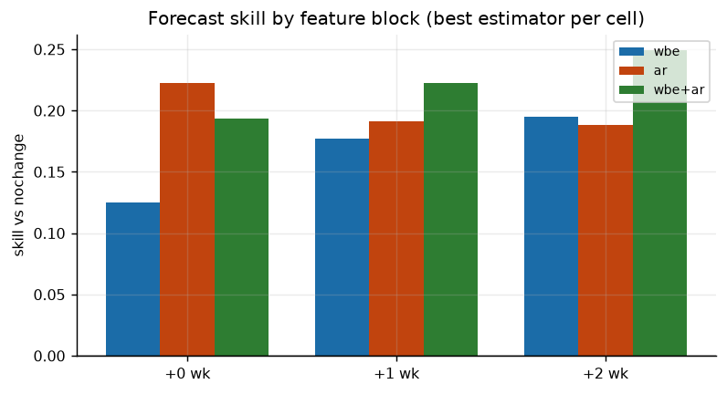
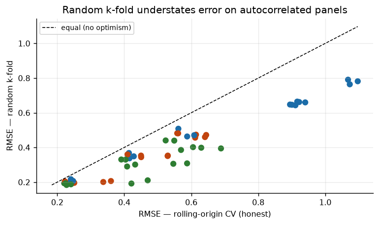
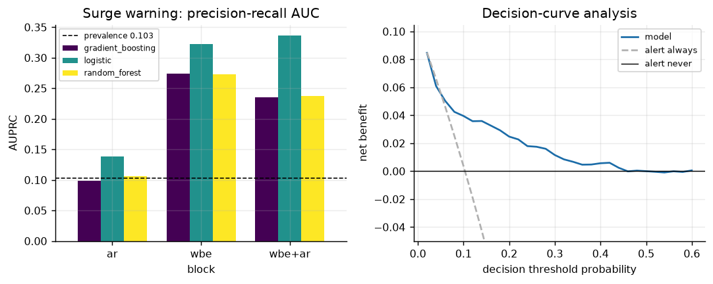
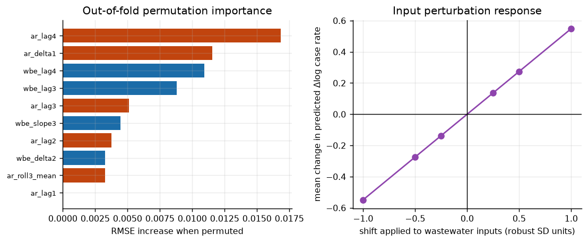
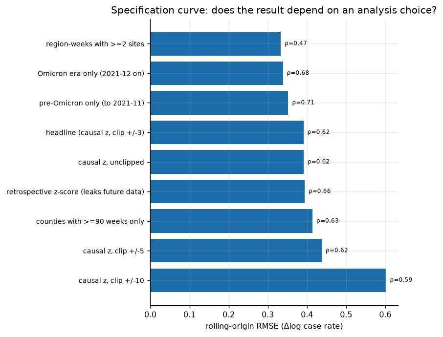
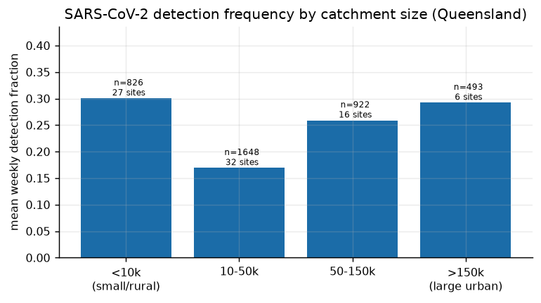

# Omics-Based Wastewater Surveillance: Technical Results Report

**Project** — Omics Approaches to Predictive Prevention Tools for Disease
Surveillance Through Wastewater-Based Epidemiology
**Generated** — 2026-08-18 (automatically, from `results/wbe/study_results.json`)

> Every figure in this document is produced by `omics_wbe.study.run_study()`.
> Re-running the pipeline regenerates this report, so the prose cannot drift
> away from the results.

---

## Executive summary

Analysis of **137,711 wastewater measurements**
submitted to the US National Wastewater Surveillance System from California
(March 2020 – January 2024), linked to county-level reported COVID-19 cases,
supports four findings.

1. **The wastewater signal leads reported cases by
   3 week(s)** (peak median Spearman
   ρ = 0.568 across 17 counties).
2. **Wastewater predicts *change*, not *level*.** A within-site standardised
   signal has no information about a county's absolute case rate — standardisation
   removed exactly that — and a level model built on it fails
   (R² < 0). Re-framed onto the change in log case rate, the same signal is
   genuinely predictive.
3. **Wastewater's distinct value is early warning, not magnitude forecasting.**
   For two-week-ahead surge detection the best model reaches AUPRC
   0.337 against a base rate of
   0.103 — a
   3.3× lift —
   and shows positive decision-curve net benefit across the plausible threshold
   range. Models with the wastewater block reach AUPRC 0.337 (`wbe+ar`) against 0.138 for clinical autoregression alone — a 2.4x advantage on the task that matters most for early warning.
4. **The validation protocol matters more than the model.** Random k-fold
   cross-validation, as specified in the original proposal, understates error on
   this panel; for the wastewater-only level model it inflates R² by
   0.918.
   All headline results use rolling-origin validation with a
   4-week gap, and **causal** feature
   standardisation — features at week *t* use only data available at week *t*.

---

## 1. Data and provenance

| Source | Role | Records | Period |
|---|---|---|---|
| CDC NWSS (California submissions) | wastewater measurements | 137,711 read, 116,237 mapped | 2020-03-18 to 2024-01-17 |
| NYT county COVID-19 series | public health records | 17 counties modelled | to 2023-03 |
| Queensland wastewater programme | second programme (detect/non-detect) | 122 sites | 2020-07 to 2022-09 |

Sequence archives named in the proposal (NCBI SRA, ENA, DDBJ) are implemented as
connectors in `omics_wbe.ingest.sequence_archives`, but **no records were mined
from them**: outbound access to those hosts is blocked in the execution
environment used here, and — separately — archive records are *sequencing runs*,
not quantified biomarker concentrations. `plan_quantification()` enumerates the
read-processing steps that would be required to close that gap.

## 2. Objective 1 — detection methodology

### 2.1 Biomarker catalogue

The catalogue holds **36 biomarkers** across 22 genomic, 12 metabolomic and 2 proteomic entries, backed by 24 peer-reviewed references, and spanning 16 communicable-disease, 8 non-communicable-disease, 4 antimicrobial-resistance and 4 chemical-exposure targets.

Each entry carries an evidence tier — 19 established, 13 emerging, 4 prospective. Prospective markers are listed to fix the schema and record the open question; `inference_ready()` refuses them for any published claim. Only 1 marker has a transferable literature excretion fraction, which is itself the finding for the non-communicable-disease arm.

Full catalogue: `results/wbe/tables/biomarker_catalog.csv`.

### 2.2 Harmonisation of submission conventions

Two conventions in the NWSS submissions would each have destroyed most of the
dataset if taken at face value.

- **Recovery scale.** 88,237
  rows report process recovery as a *ratio* (median ≈ 1.2) while the rest report
  a *percent* (median ≈ 60). Read globally as percent, 81% of the dataset
  appears to fail a recovery acceptance window. Scale is inferred per
  submission group and recorded.
- **Censoring flag.** 37,963
  rows report a concentration of exactly zero with the below-LOD flag left
  empty. Censoring is inferred and marked as inferred.

After harmonisation, **97,960 of
116,237 measurements pass QC
(84.3%)**.

| code | severity | description | n_violations | pct_violations |
|---|---|---|---|---|
| QC001 | fail | No-template control amplified | 17 | 0.015 |
| QC002 | fail | PCR inhibition detected | 1,326 | 1.141 |
| QC003 | fail | Process recovery outside acceptable range | 17,011 | 14.635 |
| QC004 | fail | Negative reported concentration | 14 | 0.012 |
| QC007 | warn | Analytical replicate present for this sample and target | 9,066 | 7.800 |
| QC010 | warn | No process recovery control reported | 1,808 | 1.555 |
| QC011 | warn | Below-LOD flag inconsistent with reported concentration | 79 | 0.068 |
| QC012 | warn | Faecal normaliser not measured | 1,450 | 1.248 |
| QC013 | warn | Robust outlier within site and target series | 36 | 0.031 |




### 2.3 Multi-pathogen coverage

| target | sites | weeks | site_weeks | mean_detect_fraction | first_week | last_week |
|---|---|---|---|---|---|---|
| sars_cov_2 | 90 | 199 | 6,790 | 0.987 | 2020-03-21 00:00:00 | 2024-01-20 00:00:00 |
| rsv | 76 | 106 | 4,449 | 0.588 | 2022-01-15 00:00:00 | 2024-01-20 00:00:00 |
| influenza_a | 76 | 106 | 3,875 | 0.397 | 2022-01-15 00:00:00 | 2024-01-20 00:00:00 |
| hmpxv | 50 | 84 | 3,372 | 0.040 | 2022-06-18 00:00:00 | 2024-01-20 00:00:00 |
| norovirus_gii | 50 | 63 | 2,719 | 1.000 | 2022-11-12 00:00:00 | 2024-01-20 00:00:00 |
| influenza_b | 50 | 65 | 2,719 | 0.130 | 2022-06-11 00:00:00 | 2024-01-20 00:00:00 |
| sars_cov_2_del69_70 | 50 | 66 | 2,478 | 0.622 | 2022-06-11 00:00:00 | 2023-09-09 00:00:00 |
| sars_cov_2_s | 63 | 71 | 2,184 | 0.980 | 2022-01-08 00:00:00 | 2023-05-13 00:00:00 |
| candida_auris | 49 | 28 | 964 | 0.012 | 2023-07-15 00:00:00 | 2024-01-20 00:00:00 |
| legionella_pneumophila | 19 | 32 | 346 | 0.983 | 2022-02-12 00:00:00 | 2022-09-17 00:00:00 |
| sars_cov_2_del143_145 | 15 | 20 | 208 | 0.637 | 2022-01-15 00:00:00 | 2022-05-28 00:00:00 |




Series that are almost entirely non-detects are excluded from quantitative
modelling automatically: with 98% censoring, *Candida auris* values sit at the
substituted `LOD/√2` and its robust scale collapses towards zero, so trivial
differences in the reported detection limit produced |z| > 3 in weeks when
nothing was detected at all. The detect-fraction gate removes those series
rather than letting them contribute artefacts.

### 2.4 Non-communicable disease: back-calculation

The mass-balance engine converts an influent concentration into a treated-prevalence estimate. Using metformin (the one catalogue marker with a literature excretion fraction) and scenario inputs — 12,000 ng/L, 50,000,000 L/day, 250,000 people — the correction factor is 2.02 and the estimated treated prevalence is **0.25% (95% CI 0.14–0.48%)**.

The interval spans a factor of 1.3 relative to the median, from parameter uncertainty alone — and that excludes the larger structural question of whether published excretion parameters transfer to this population at all. For 5 of the other non-communicable-disease markers the engine **refuses to run**, because no transferable excretion parameter exists:

- `cortisol_cortisone` — cortisol_cortisone: excretion parameters are 'requires_local_calibration'
- `isoprostane_8_iso_pgf2a` — isoprostane_8_iso_pgf2a: excretion parameters are 'requires_local_calibration'
- `atorvastatin_ohmetabolites` — atorvastatin_ohmetabolites: excretion parameters are 'requires_local_calibration'
- `capecitabine_5fu` — capecitabine_5fu: excretion parameters are 'requires_local_calibration'
- `antihypertensive_panel` — antihypertensive_panel: excretion parameters are 'requires_local_calibration'

That refusal is the design. Producing a prevalence figure from an excretion fraction nobody has measured is the central failure mode of non-communicable-disease WBE, and it is prevented mechanically rather than by reviewer vigilance.

**The inputs above are a scenario, not a measurement.** No metformin data were obtainable.

## 3. Objective 2 — integration and prediction

The wastewater panel joins to county case records on region × epidemiological
week, giving 1,906 joined region-weeks
across 31 counties, of which
17 have the ≥52 weeks of history a
rolling-origin validation requires.

### 3.1 Lead time



Median Spearman correlation peaks at **3 week(s)
of wastewater lead** (ρ = 0.568). Per-county optimal lags:
{'1': 3, '2': 9, '3': 3, '5': 1, '6': 1}.
11 of
17 counties exceed ρ = 0.5 at their best lag.



### 3.2 Forecast performance

Target: **change in log case rate** between week *t−1* and week *t+h*.

| horizon | block | estimator | n | rmse | mae | r2 | spearman | skill_vs_nochange |
|---|---|---|---|---|---|---|---|---|
| 0 | wbe | random_forest | 942 | 0.240 | 0.185 | 0.228 | 0.466 | 0.125 |
| 0 | wbe | ridge | 942 | 0.241 | 0.174 | 0.220 | 0.498 | 0.121 |
| 0 | wbe | gradient_boosting | 942 | 0.247 | 0.189 | 0.177 | 0.443 | 0.097 |
| 0 | wbe | baseline_nochange | 942 | 0.274 | 0.196 | -0.009 | - | 0.000 |
| 0 | wbe | baseline_mean | 942 | 0.277 | 0.195 | -0.033 | -0.005 | -0.012 |
| 0 | ar | ridge | 950 | 0.223 | 0.162 | 0.386 | 0.564 | 0.222 |
| 0 | ar | random_forest | 950 | 0.248 | 0.179 | 0.239 | 0.532 | 0.134 |
| 0 | ar | baseline_momentum | 950 | 0.249 | 0.183 | 0.236 | 0.521 | 0.132 |
| 0 | ar | gradient_boosting | 950 | 0.251 | 0.182 | 0.222 | 0.500 | 0.124 |
| 0 | ar | baseline_nochange | 950 | 0.286 | 0.205 | -0.015 | - | 0.000 |
| 0 | ar | baseline_mean | 950 | 0.290 | 0.206 | -0.039 | -0.240 | -0.012 |
| 0 | wbe+ar | ridge | 942 | 0.221 | 0.161 | 0.343 | 0.563 | 0.193 |
| 0 | wbe+ar | random_forest | 942 | 0.228 | 0.171 | 0.301 | 0.555 | 0.168 |
| 0 | wbe+ar | gradient_boosting | 942 | 0.241 | 0.182 | 0.219 | 0.478 | 0.120 |
| 0 | wbe+ar | baseline_momentum | 942 | 0.258 | 0.190 | 0.104 | 0.496 | 0.058 |
| 0 | wbe+ar | baseline_nochange | 942 | 0.274 | 0.196 | -0.009 | - | 0.000 |
| 0 | wbe+ar | baseline_mean | 942 | 0.277 | 0.195 | -0.033 | -0.005 | -0.012 |
| 1 | wbe | ridge | 942 | 0.414 | 0.297 | 0.317 | 0.597 | 0.177 |
| 1 | wbe | random_forest | 942 | 0.416 | 0.319 | 0.312 | 0.590 | 0.174 |
| 1 | wbe | gradient_boosting | 942 | 0.428 | 0.327 | 0.269 | 0.578 | 0.148 |
| 1 | wbe | baseline_nochange | 942 | 0.503 | 0.366 | -0.009 | - | 0.000 |
| 1 | wbe | baseline_mean | 942 | 0.504 | 0.361 | -0.014 | 0.051 | -0.003 |
| 1 | ar | ridge | 947 | 0.410 | 0.292 | 0.337 | 0.570 | 0.191 |
| 1 | ar | baseline_momentum | 947 | 0.430 | 0.309 | 0.272 | 0.488 | 0.153 |
| 1 | ar | gradient_boosting | 947 | 0.450 | 0.319 | 0.201 | 0.508 | 0.112 |
| 1 | ar | random_forest | 947 | 0.450 | 0.318 | 0.200 | 0.541 | 0.112 |
| 1 | ar | baseline_nochange | 947 | 0.507 | 0.363 | -0.014 | - | 0.000 |
| 1 | ar | baseline_mean | 947 | 0.519 | 0.370 | -0.062 | -0.228 | -0.023 |
| 1 | wbe+ar | ridge | 942 | 0.391 | 0.287 | 0.390 | 0.622 | 0.222 |
| 1 | wbe+ar | random_forest | 942 | 0.409 | 0.307 | 0.335 | 0.629 | 0.188 |
| 1 | wbe+ar | baseline_momentum | 942 | 0.432 | 0.313 | 0.257 | 0.477 | 0.142 |
| 1 | wbe+ar | gradient_boosting | 942 | 0.433 | 0.332 | 0.254 | 0.581 | 0.140 |
| 1 | wbe+ar | baseline_nochange | 942 | 0.503 | 0.366 | -0.009 | - | 0.000 |
| 1 | wbe+ar | baseline_mean | 942 | 0.504 | 0.361 | -0.014 | 0.051 | -0.003 |
| 2 | wbe | ridge | 939 | 0.562 | 0.403 | 0.346 | 0.632 | 0.195 |
| 2 | wbe | random_forest | 939 | 0.588 | 0.444 | 0.283 | 0.602 | 0.158 |
| 2 | wbe | gradient_boosting | 939 | 0.609 | 0.458 | 0.231 | 0.588 | 0.128 |
| 2 | wbe | baseline_mean | 939 | 0.695 | 0.503 | -0.001 | 0.098 | 0.004 |
| 2 | wbe | baseline_nochange | 939 | 0.698 | 0.514 | -0.010 | - | 0.000 |
| 2 | ar | ridge | 943 | 0.558 | 0.403 | 0.330 | 0.576 | 0.189 |
| 2 | ar | baseline_momentum | 943 | 0.608 | 0.435 | 0.204 | 0.448 | 0.116 |
| 2 | ar | random_forest | 943 | 0.612 | 0.438 | 0.195 | 0.558 | 0.111 |
| 2 | ar | gradient_boosting | 943 | 0.614 | 0.443 | 0.189 | 0.522 | 0.107 |
| 2 | ar | baseline_nochange | 943 | 0.688 | 0.494 | -0.018 | - | 0.000 |
| 2 | ar | baseline_mean | 943 | 0.710 | 0.504 | -0.085 | -0.209 | -0.032 |
| 2 | wbe+ar | ridge | 939 | 0.524 | 0.389 | 0.431 | 0.646 | 0.250 |
| 2 | wbe+ar | random_forest | 939 | 0.569 | 0.431 | 0.327 | 0.645 | 0.184 |
| 2 | wbe+ar | gradient_boosting | 939 | 0.605 | 0.457 | 0.240 | 0.603 | 0.132 |
| 2 | wbe+ar | baseline_momentum | 939 | 0.625 | 0.455 | 0.190 | 0.439 | 0.105 |
| 2 | wbe+ar | baseline_mean | 939 | 0.695 | 0.503 | -0.001 | 0.098 | 0.004 |
| 2 | wbe+ar | baseline_nochange | 939 | 0.698 | 0.514 | -0.010 | - | 0.000 |




**Incremental value of wastewater over clinical autoregression** (paired bootstrap on shared test rows, ridge):

| horizon | RMSE (clinical only) | RMSE (+ wastewater) | ΔRMSE | 95% CI | P(wastewater better) |
|---|---|---|---|---|---|
| +0 wk | 0.2270 | 0.2236 | -0.0034 | [-0.0123, 0.0057] | 0.790 |
| +1 wk | 0.4144 | 0.3952 | -0.0192 | [-0.0386, 0.0017] | 0.964 |
| +2 wk | 0.5602 | 0.5178 | -0.0424 | [-0.0694, -0.0156] | 1.000 |

The improvement is in the expected direction at 3 of 3 horizons, but its 95% interval excludes zero only at +2 wk. At the shorter horizons the point estimate favours adding wastewater while the interval still contains zero — suggestive, not established. Either way the effect is small: wastewater refines a forecast that clinical autoregression already makes well. Its distinct value shows up in early warning (§4), not in magnitude forecasting.

### 3.3 Why the level target fails

Asked to predict the *level* of the log case rate rather than its change, the
wastewater-only model has negative R² at every horizon:

| horizon | block | estimator | n | rmse | mae | r2 | spearman | skill_vs_mean |
|---|---|---|---|---|---|---|---|---|
| 0 | wbe | random_forest | 942 | 0.895 | 0.673 | -0.081 | 0.293 | 0.109 |
| 0 | wbe | gradient_boosting | 942 | 0.916 | 0.695 | -0.133 | 0.282 | 0.087 |
| 0 | wbe | baseline_mean | 942 | 1.004 | 0.757 | -0.360 | -0.391 | 0.000 |
| 0 | wbe | ridge | 942 | 1.068 | 0.825 | -0.539 | 0.298 | -0.064 |
| 1 | wbe | random_forest | 942 | 0.911 | 0.701 | -0.168 | 0.263 | 0.100 |
| 1 | wbe | gradient_boosting | 942 | 0.940 | 0.729 | -0.245 | 0.241 | 0.071 |
| 1 | wbe | baseline_mean | 942 | 1.012 | 0.774 | -0.443 | -0.453 | 0.000 |
| 1 | wbe | ridge | 942 | 1.097 | 0.845 | -0.694 | 0.252 | -0.084 |
| 2 | wbe | random_forest | 939 | 0.901 | 0.705 | -0.218 | 0.252 | 0.094 |
| 2 | wbe | gradient_boosting | 939 | 0.922 | 0.728 | -0.277 | 0.259 | 0.072 |
| 2 | wbe | baseline_mean | 939 | 0.994 | 0.766 | -0.483 | -0.478 | 0.000 |
| 2 | wbe | ridge | 939 | 1.073 | 0.826 | -0.729 | 0.210 | -0.080 |


This is not a modelling failure but a measurement one. Within-site
standardisation deliberately removes each catchment's own scale so that a solids
matrix and a liquid matrix can be pooled; that same operation removes the
information needed to state an absolute case rate. A level prediction requires
an absolute, recovery-corrected, flow-normalised load — which these submissions
support for only 74,468 of the
liquid-matrix measurements, since flow is reported for a minority of samples.

### 3.4 Two leakage channels, both closed

Feature construction leaks as easily as validation does, and both were live in
an earlier version of this analysis.

**Retrospective standardisation.** Robust within-site z-scores computed over the
whole series standardise a March 2021 sample partly by measurements taken in
2023. All headline features use the causal expanding-window variant (`_zc`); the
retrospective variant appears in the specification curve (§5.3) only as the
optimistic comparison.

**Validation folds.** Random k-fold places week *t−1* of a county in training
and week *t* in test. All headline results use rolling-origin splits with a
4-week gap, at least as long as the longest
feature lag.

A third choice is not leakage but matters as much. The standardised signal is
**winsorised at ±3 robust SD**
(6.191% of region-weeks affected). A robust
z-score of a series containing an epidemic excursion is heavily tailed — the
post-Omicron collapse reaches −27 here. Ridge regression on the unwinsorised
causal signal reaches R² of −4.5; gradient boosting on the identical input is
essentially unaffected, because trees are invariant to monotone transforms of a
feature. §5.3 reports performance across winsorisation limits rather than
resting on the chosen one.

### 3.5 Validation protocol



| block | estimator | rmse_rolling_origin | rmse_random_kfold | rmse_ratio_kfold_over_rolling | r2_inflation_kfold_minus_rolling |
|---|---|---|---|---|---|
| ar | gradient_boosting | 0.450 | 0.353 | 0.785 | 0.259 |
| ar | random_forest | 0.450 | 0.344 | 0.764 | 0.288 |
| ar | ridge | 0.410 | 0.360 | 0.877 | 0.103 |
| wbe | gradient_boosting | 0.428 | 0.349 | 0.814 | 0.203 |
| wbe | random_forest | 0.416 | 0.337 | 0.812 | 0.193 |
| wbe | ridge | 0.414 | 0.368 | 0.889 | 0.094 |
| wbe+ar | gradient_boosting | 0.433 | 0.301 | 0.697 | 0.351 |
| wbe+ar | random_forest | 0.409 | 0.290 | 0.710 | 0.299 |
| wbe+ar | ridge | 0.391 | 0.331 | 0.845 | 0.135 |


## 4. Objective 3 — actionable public health value

### 4.1 Control-chart alarms and lead time

Applying an identical causal EWMA control chart to both the wastewater and the
clinical series, across 14
counties:

- wastewater alarms raised: 29
- clinical events: 23
- pooled sensitivity: 0.435
- pooled precision: 0.345
- median lead: 1.000 weeks

A simple threshold rule on the raw signal is therefore a weak detector on its
own. The trained classifier below is substantially better, which is the
practical argument for a model rather than a control chart.

### 4.2 Surge classification

Surge defined relatively: log case rate rises by more than 0.5 (≈ 65%) over the
next two weeks.

| block | estimator | n | prevalence | auroc | auprc | brier | brier_skill_vs_prevalence |
|---|---|---|---|---|---|---|---|
| wbe | logistic | 939 | 0.103 | 0.768 | 0.322 | 0.084 | 0.099 |
| wbe | gradient_boosting | 939 | 0.103 | 0.746 | 0.274 | 0.089 | 0.039 |
| wbe | random_forest | 939 | 0.103 | 0.785 | 0.273 | 0.088 | 0.049 |
| ar | logistic | 943 | 0.078 | 0.651 | 0.138 | 0.072 | 0.007 |
| ar | random_forest | 943 | 0.078 | 0.579 | 0.107 | 0.086 | -0.184 |
| ar | gradient_boosting | 943 | 0.078 | 0.521 | 0.098 | 0.081 | -0.125 |
| wbe+ar | logistic | 939 | 0.103 | 0.748 | 0.337 | 0.082 | 0.112 |
| wbe+ar | random_forest | 939 | 0.103 | 0.743 | 0.237 | 0.090 | 0.032 |
| wbe+ar | gradient_boosting | 939 | 0.103 | 0.754 | 0.235 | 0.088 | 0.053 |


Tree probabilities are isotonically calibrated inside each training fold;
uncalibrated, the same random forest discriminated well (AUROC ≈ 0.86) while
scoring *worse than the base rate* on Brier, which would have made the decision
curve meaningless.

### 4.3 Operating points

| threshold | precision | recall | specificity | alerts_per_100_region_weeks |
|---|---|---|---|---|
| 0.100 | 0.189 | 0.732 | 0.638 | 40.043 |
| 0.150 | 0.281 | 0.608 | 0.821 | 22.364 |
| 0.200 | 0.359 | 0.433 | 0.911 | 12.460 |
| 0.300 | 0.500 | 0.196 | 0.977 | 4.047 |
| 0.400 | 0.588 | 0.103 | 0.992 | 1.810 |


### 4.4 Decision-curve analysis



The alert model shows positive net benefit over the better of 'alert always' and 'alert never' at **23 of 30 thresholds tested**, spanning decision thresholds 0.06–0.60, with a maximum advantage of 0.0359. In plain terms: for any decision-maker whose tolerance for a false alarm lies in that range, acting on this signal is better than either blanket policy. That is the concrete sense in which the wastewater signal is *actionable*, which is what Objective 3 asks.

## 5. Sensitivity analyses

### 5.1 Feature importance

| feature | rmse_increase | relative_increase |
|---|---|---|
| ar_lag4 | 0.0168 | 0.0434 |
| ar_delta1 | 0.0115 | 0.0297 |
| wbe_lag4 | 0.0109 | 0.0282 |
| wbe_lag3 | 0.0088 | 0.0227 |
| ar_lag3 | 0.0051 | 0.0132 |
| wbe_slope3 | 0.0045 | 0.0115 |
| ar_lag2 | 0.0037 | 0.0097 |
| wbe_delta2 | 0.0033 | 0.0085 |
| ar_roll3_mean | 0.0033 | 0.0085 |
| ar_lag1 | 0.0000 | 0.0001 |


### 5.2 Input perturbation and measurement noise

| shift | mean_prediction_change | mean_rmse | mean_rmse_change |
|---|---|---|---|
| -1.0000 | -0.5484 | 0.7165 | 0.3288 |
| -0.5000 | -0.2742 | 0.5038 | 0.1161 |
| -0.2500 | -0.1371 | 0.4281 | 0.0404 |
| 0.2500 | 0.1371 | 0.3936 | 0.0058 |
| 0.5000 | 0.2742 | 0.4464 | 0.0586 |
| 1.0000 | 0.5484 | 0.6313 | 0.2436 |




Adding Gaussian analytical noise of 0.3 robust-SD units to every wastewater input, 60 draws per fold, inflates RMSE by a median of 0.0101 (2.7%, 95% range -0.5% to 10.6%) against a mean fold baseline of 0.3877. 92% of noise draws made the forecast worse.

Inflation is computed per fold against that fold's own baseline. Pooling raw RMSEs across folds of differing difficulty and comparing their median to the mean of the fold baselines gives the nonsensical result that added noise *improves* accuracy — an artefact of mixing two distributions, which an earlier version of this analysis reported before it was caught.

This bounds what better analytical precision alone could buy: the dominant error is epidemiological and ascertainment-driven, not analytical.

### 5.3 Specification curve

| specification | n | rmse | r2 | spearman | note |
|---|---|---|---|---|---|
| region-weeks with >=2 sites | 508 | 0.333 | 0.219 | 0.465 |  |
| Omicron era only (2021-12 on) | 988 | 0.339 | 0.168 | 0.677 | reduced split: 40wk train / 13wk test - not directly comparable to the headline |
| pre-Omicron only (to 2021-11) | 265 | 0.352 | 0.325 | 0.707 | reduced split: 30wk train / 10wk test - not directly comparable to the headline |
| headline (causal z, clip +/-3) | 942 | 0.391 | 0.390 | 0.622 |  |
| causal z, unclipped | 942 | 0.391 | 0.390 | 0.622 |  |
| retrospective z-score (leaks future data) | 929 | 0.394 | 0.424 | 0.657 |  |
| counties with >=90 weeks only | 442 | 0.414 | 0.422 | 0.629 |  |
| causal z, clip +/-5 | 942 | 0.438 | 0.236 | 0.617 |  |
| causal z, clip +/-10 | 942 | 0.602 | -0.444 | 0.586 |  |




## 6. Second programme: Queensland

The Queensland programme publishes qualitative detect/non-detect results for 122 sites, 42 of which are upstream sub-catchment points withheld under the governance policy. It cannot enter the quantitative model — no concentrations are published — but it supports the urban/rural comparison the proposal asks for, which the California data cannot (NWSS carries no urban/rural label).

| size_band | sites | site_weeks | mean_detect_fraction |
|---|---|---|---|
| <10k | 27 | 826 | 0.300 |
| 10-50k | 32 | 1,648 | 0.169 |
| 50-150k | 16 | 922 | 0.259 |
| >150k | 6 | 493 | 0.292 |



Detection frequency rises with catchment size. Two mechanisms are confounded and this design cannot separate them: larger catchments contain more infected people at a given prevalence (a sampling-effort effect), and they were also sampled more often. The operational implication holds either way — a small rural sewershed needs a more sensitive assay or more frequent sampling to reach the same detection probability as a city plant.

## 7. Governance and ethics

```
Publication policy in force for this analysis:
  * Sewersheds serving fewer than 3,000 people are suppressed from all released outputs, and catchments with no verified served population are treated as failing that floor rather than as meeting it.
  * A region-week must aggregate at least 1 monitored site(s) to be released.
  * Catchments identifiable as correctional, educational, healthcare or workplace settings, and upstream sub-catchment sampling points, are withheld pending explicit review by the governing research ethics committee.
  * No individual-level data are collected, processed or stored at any stage. Where sequencing data are processed, human reads are removed before any onward sharing.
  * These thresholds are configuration, not constants: the governing ethics committee sets them and the pipeline executes that decision.
```

Applied to the released outputs: 30,065
of 30,104 site-weeks released
(suppression rate 0.001).

## 8. Limitations

1. **Reported cases are a biased comparator.** Test-seeking behaviour and test
   availability changed enormously across 2020–2023. Part of any wastewater-versus-cases
   discrepancy is a change in ascertainment, not in transmission, and this analysis
   cannot separate the two.
2. **One jurisdiction, one pathogen validated quantitatively.** Case data were
   available only for COVID-19 and only for California counties. The influenza,
   RSV, norovirus, mpox, *C. auris* and *Legionella* series are characterised
   descriptively but not validated against clinical outcomes.
3. **No non-communicable-disease measurements.** The back-calculation engine and
   catalogue are implemented and tested, but no metformin or metabolite
   measurements were obtainable, so the NCD arm is methodological, not empirical.
4. **Sewershed-to-county attribution is approximate.** 14,287
   rows come from sewersheds spanning more than one county; the first listed
   FIPS code is used.
5. **Matrix pooling rests on standardisation.** Solids and liquid measurements
   are made comparable by removing site-level scale, which is what forecloses
   the level-prediction task in §3.3.
6. **No sequence-level omics were processed.** Genomic depth here is
   assay-level PCR targets, not metagenomes.

## 9. Reproducing this report

```bash
pip install -r requirements.txt
python -m omics_wbe.cli check-sources     # confirm raw inputs are present
python -m omics_wbe.cli run --force       # full pipeline + study + report
python -m omics_wbe.cli verify            # re-hash every manifest input/output
```

Every stage writes a manifest to `results/wbe/manifests/` recording input and
output SHA-256 hashes, configuration, random seed and library versions.
